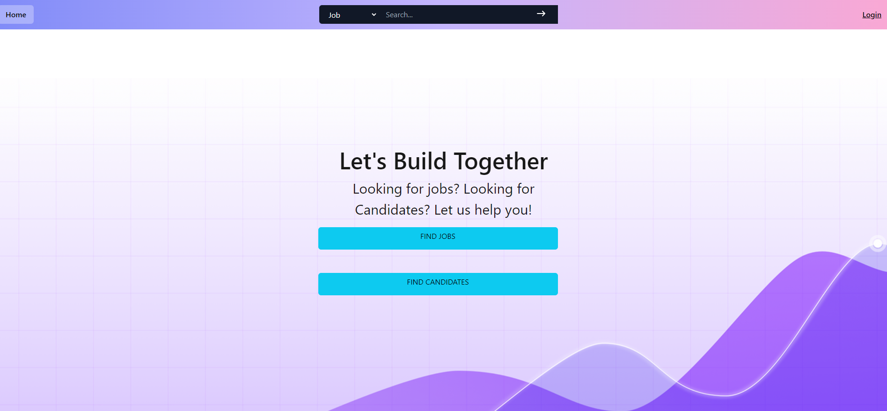

# Connected

Connected is an application designed to streamline the process of connecting candidates with the right staffing agencies or recruiters to help them secure the best-paying job opportunities quickly. Similar to the real estate model, where agents advertise properties and find buyers for a commission, Connected enables recruiters to advertise candidates and match them with suitable job opportunities in exchange for a fee.

## Key Features

### For Candidates

1. **User Profile and Skills Management**: Candidates can create and maintain their profiles, including skills, experience, and desired timeline for finding a job.
2. **Resume Upload**: Candidates have the option to upload their resumes to showcase their qualifications to recruiters.
3. **Agency Research and Review**: Candidates can research and review various staffing agencies and recruiters to find the most suitable ones for their job search.
4. **Job Viewing and Recruiter Connection**: Candidates can browse available job opportunities and connect with recruiters for further discussions.
5. **Job Commitment and Resume Staging**: Candidates can partner with agencies, tasking them to find suitable job opportunities, and stage their resumes for specific jobs.
6. **Dashboard for Job Commitments**: Candidates have access to a dashboard that provides an overview of all the jobs they have committed to.

### For Recruiters

1. **Recruiter Account Management**: Recruiters can log in to their accounts and manage their job opportunities and agency fee information.
2. **Tracking Committed Candidates**: Recruiters can view candidates who have recently committed to a job and agreed to pay the agency commission.
3. **Dashboard for Candidate Management**: Recruiters have access to a dashboard that displays candidates who have committed to their job opportunities and candidates they have pushed or applied to companies.
4. **Favorite Jobs Insight**: Recruiters can view a candidate's favorite jobs, gaining insights into their preferences and interests.

## Technology Stack

- **Frontend**: The frontend of Connected is developed using React, ensuring a modern and dynamic user interface.
- **Backend**: The backend utilizes GraphQL with a Node.js and Express.js server, providing a flexible and efficient communication layer between the client and the server.
- **Database**: MongoDB, a popular NoSQL database, is used in conjunction with the Mongoose ODM (Object Data Modeling) for data storage and management.
- **Queries and Mutations**: GraphQL is employed to handle queries and mutations for retrieving, adding, updating, and deleting data efficiently and precisely.
- **Deployment**: Connected is deployed on Heroku, ensuring that the application is accessible and functional for users. The deployment includes the necessary data for a seamless user experience.
- **User Interface**: The UI of Connected is designed with a focus on polish, offering a visually appealing and intuitive experience for candidates and recruiters.
- **Responsiveness**: The application is built to be responsive, ensuring that it adapts seamlessly to different screen sizes and devices, providing an optimal experience regardless of the platform.
- **Interactivity**: Connected is highly interactive, accepting and responding to user input promptly, providing real-time updates and feedback throughout the application.
- **Authentication**: The application includes authentication functionality using JSON Web Tokens (JWT), ensuring secure access for candidates and recruiters while protecting their sensitive information.
- **API Key Protection**: Sensitive API key information is properly handled and protected on the server, implementing best practices for securing and managing sensitive data.

## Getting Started

To use Connected, follow these steps:

1. Visit the Connected website and create an account as a candidate or recruiter.
2. For Candidates:
   - Set up your profile, including skills, experience, and desired timeline.
   - Upload your resume(s) to showcase your qualifications.
   - Research and review various staffing agencies to find the right match.
   - View job opportunities and connect with recruiters.
   - Partner with agencies and task them to find suitable jobs for you.
   - Stage your resume for specific job opportunities.
   - Monitor your dashboard to track the jobs you have committed to.
3. For Recruiters:
   - Log in to your recruiter account.
   - Post, update, or delete job opportunities and agency fee information.
   - Track candidates who have recently committed to a job and agreed to pay the agency commission.
   - Use the dashboard to manage candidates who have committed to your job opportunities.
   - Explore a candidate's favorite jobs to gain valuable insights.

## Development

Connected was developed using modern web technologies. The application utilizes a combination of frontend and backend frameworks to deliver a seamless user experience. The codebase follows industry-standard best practices and is scalable for future enhancements.

## Project Checklist

Please check the boxes below to indicate that the project meets the specified criteria:

- [x] Use React for the front end.
- [x] Use GraphQL with a Node.js and Express.js server.
- [x] Use MongoDB and the Mongoose ODM for the database.
- [x] Use queries and mutations for retrieving, adding, updating, and deleting data.
- [x] Be deployed using Heroku (with data).
- [x] Have a polished UI.
- [x] Be responsive.
- [x] Be interactive (i.e., accept and respond to user input).
- [x] Include authentication (JWT).
- [x] Protect sensitive API key information on the server.

## Feedback and Support

If you encounter any issues while using Connected or have suggestions for improvement, please submit a detailed issue in the issue tracker on the project repository. Our team will review your feedback and provide timely support.

## License

Connected is released under the [MIT License](LICENSE). You are free to use, modify, and distribute the application in accordance with the terms of the license.

## Screenshots
